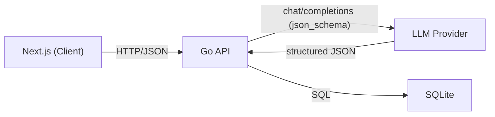

# Triador — Resume Analysis SPA


## Overview

Ferramenta de análise de aderência de currículos a vagas via LLM. Recebe texto de currículo e descrição de vaga, chama um provedor OpenAI-compatible, e retorna uma avaliação estruturada com nome do candidato, skills técnicas, anos de experiência, fit score (0–100) e resumo justificado. Cada análise é persistida em SQLite e o histórico completo fica disponível via API e interface web.

## Architecture



O backend segue separação de camadas intencional: **handler** HTTP recebe e valida requests, **service** orquestra a chamada ao LLM e valida a saída estruturada, **repository** persiste via transações atômicas. Cada camada depende de interfaces — não de implementações concretas.

## Tech Stack

| Layer | Technology |
|---|---|
| Frontend | Next.js 16, React 19, TypeScript |
| Backend | Go 1.24 |
| Database | SQLite (via `database/sql` + `mattn/go-sqlite3`) |
| AI | BYOK OpenAI-compatible API (structured output via `json_schema`) |
| Routing | `http.NewServeMux` (Go 1.22+ native method routing) |

## Why Go

**Tipagem estática e parsing seguro.** O serviço parseia saída JSON de um LLM — dados não-determinísticos por natureza. Tipagem estática elimina uma classe inteira de erros em runtime que seriam silenciosos em linguagens dinâmicas. A validação pós-parse do `fit_score` (range 0–100), campos obrigatórios e tipos é feita em compile-time garantido.

**Stdlib HTTP.** `net/http` com `NewServeMux` cobre o escopo completo sem dependência de framework externo. Routing por método HTTP (`POST /analyses`, `GET /analyses`) está disponível nativamente desde Go 1.22 — zero overhead de abstração.

**Concorrência nativa.** Chamadas a provedores de LLM são I/O-bound com latência de segundos. O modelo de goroutines do Go é projetado exatamente para esse cenário — cada request é servido em sua goroutine sem custo relevante de memória, sem callbacks e sem async/await.

**Binário único.** `go build` produz um executável estático sem dependências de runtime. Isso simplifica deploy, reprodução local e avaliação do projeto — basta compilar e rodar.

## Project Structure

```
.
├── cmd/server/main.go          # entrypoint — wires all dependencies
├── internal/
│   ├── domain/                 # Analysis, AnalysisResult, ErrValidation
│   ├── handler/                # HTTP layer, CORS middleware
│   ├── service/                # LLM orchestration, output validation
│   ├── repository/             # SQLite persistence, transactional Save
│   ├── llm/                    # OpenAI client, schema generation
│   └── prompts/                # isolated prompt construction
├── config/                     # env-based configuration
├── frontend/                   # Next.js app
│   └── src/
│       ├── app/                # page, layout
│       ├── components/         # AnalysisForm, AnalysisResult, HistoryList
│       └── lib/                # api.ts — all HTTP calls centralized
├── .env.example
└── README.md
```

## Prerequisites

- Go 1.24+
- Node.js 18+
- `gcc` (necessário para compilação do `go-sqlite3` via CGO)
- API key de provedor OpenAI-compatible (OpenAI, Groq, Together, OpenRouter, etc.)
- Docker + Docker Compose (opcional — para setup containerizado)

## Local Setup

```bash
# 1. clone
git clone https://github.com/di5rupt0r/triador-aiia.git
cd triador-aiia

# 2. backend env
cp .env.example .env
# edite .env e configure OPENAI_API_KEY
# opcionalmente configure OPENAI_BASE_URL e OPENAI_MODEL

# 3. run backend
env $(cat .env | xargs) go run cmd/server/main.go
# server listening on :9000

# 4. frontend (novo terminal)
cd frontend
cp .env.local.example .env.local
npm install
npm run dev
# abre em http://localhost:3000
```

### Com Docker Compose

```bash
cp .env.example .env
# configure OPENAI_API_KEY no .env
docker compose up --build
```

Frontend em `http://localhost:3000`, backend em `http://localhost:9000`.

## Environment Variables

| Variable | Required | Default | Description |
|---|---|---|---|
| `OPENAI_API_KEY` | ✅ | — | API key do provedor LLM |
| `OPENAI_BASE_URL` | ❌ | `https://api.openai.com/v1` | Base URL (trocar para Groq, Ollama, etc.) |
| `OPENAI_MODEL` | ❌ | `gpt-4o-mini` | Nome do modelo |
| `DATABASE_PATH` | ❌ | `./triador-aiia.db` | Caminho do arquivo SQLite |
| `SERVER_PORT` | ❌ | `9000` | Porta do backend |
| `NEXT_PUBLIC_API_URL` | ✅ (frontend) | `http://localhost:9000` | URL do backend para o frontend |

## API Reference

### `POST /analyses`

```jsonc
// request
{
  "resume": "João Silva. 6 anos de experiência com Go, PostgreSQL e Docker...",
  "job_description": "Buscamos engenheiro backend com experiência em Go e SQL..."
}

// response 201
{
  "id": 1,
  "candidate_name": "João Silva",
  "skills": ["Go", "PostgreSQL", "Docker"],
  "years_experience": 6,
  "fit_score": 87,
  "summary": "Candidato com forte aderência à vaga...",
  "created_at": "2026-05-28T21:00:00Z"
}
```

### `GET /analyses`

```jsonc
// response 200
[
  { /* ...analysis */ },
  { /* ...analysis */ }
]
```

Lista vazia retorna `[]`, nunca `null`.

### Errors

| Status | Causa |
|---|---|
| `400` | Body inválido ou campos obrigatórios ausentes |
| `422` | LLM retornou saída que falhou na validação semântica |
| `500` | Falha de infraestrutura (LLM indisponível, banco inacessível) |

Body de erro sempre no formato `{"error": "mensagem"}`.

## Design Decisions

- **`domain.ErrValidation` sentinel** — separa erro semântico do LLM (422) de falha de infra (500) via `errors.Is` limpo no handler, sem parsing de string
- **`Save` popula `ID` e `CreatedAt` por ponteiro** — `ID` via `LastInsertId()`, `CreatedAt` via `SELECT` do valor gerado pelo SQLite (`DEFAULT unixepoch()`) após commit
- **Skills normalizadas em tabela separada** — `analysis_skills` com FK e índice, permite consultas eficientes por skill sem parsing de JSON
- **Structured outputs via `json_schema`** — schema gerado por reflection da struct Go usando `invopop/jsonschema`, sem manutenção manual de schema
- **Chat Completions API** (não Responses API) — compatibilidade máxima com provedores alternativos que implementam `/v1/chat/completions`
- **CORS `*`** — adequado para desenvolvimento; deve ser restringido em produção
- **Frontend atualiza histórico otimisticamente** — após POST bem-sucedido, insere no topo do estado local sem refetch do GET
- **Retry com backoff exponencial** — 3 tentativas, base 500ms, jitter aleatório, respeita `ctx.Done()` para cancelamento

## Testes

```bash
# testes unitários do service (mock do LLM — sem chamada real à API)
go test ./internal/service/...
```

Cobre: resposta válida, JSON malformado, campos ausentes, fit_score fora de range, skills vazias e falha de infra do LLM — com verificação correta do sentinel `domain.ErrValidation`.

## Next Steps

- Restringir CORS para domínio específico em produção
- Testes de integração cobrindo parsing da saída do LLM com respostas reais
- Autenticação e rate limiting (fora de escopo do desafio)
- Streaming da resposta para o frontend via SSE
- Paginação no endpoint `GET /analyses`
